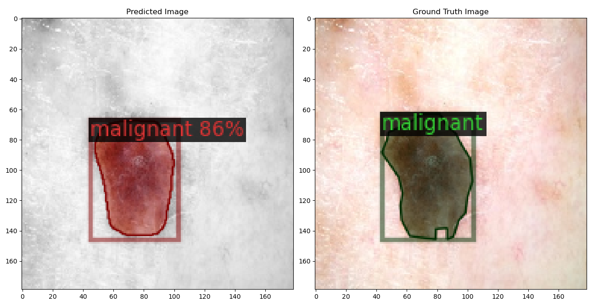
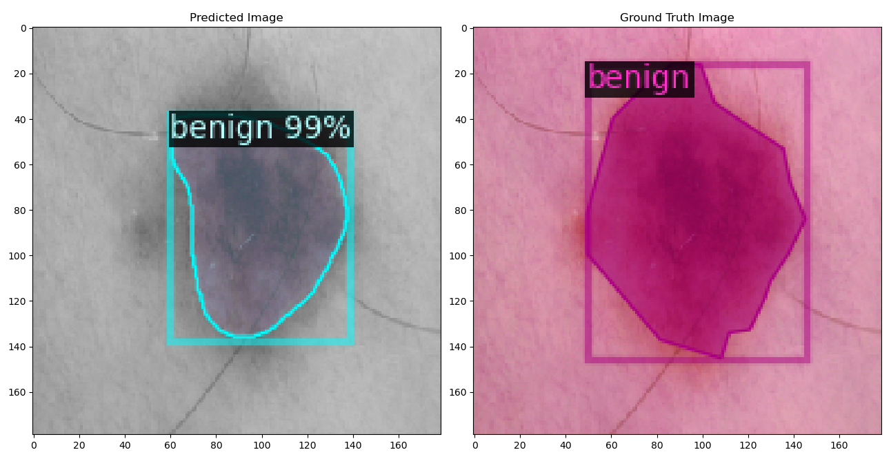
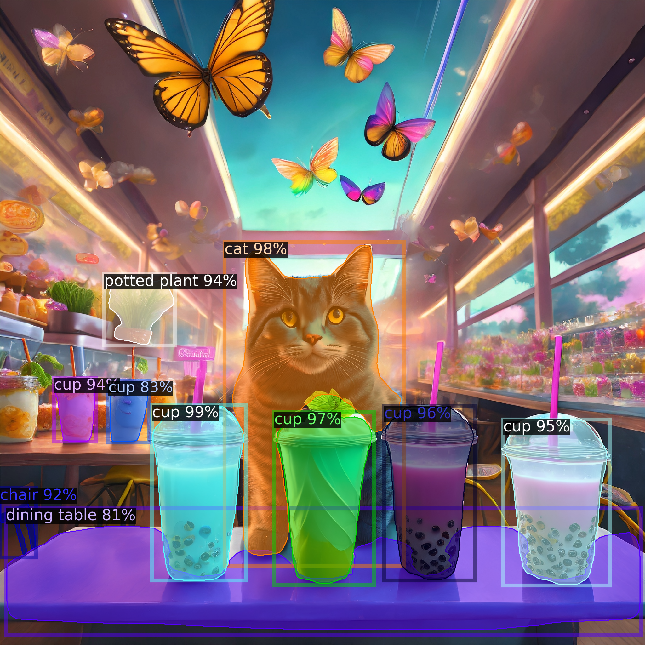

<!-- Shields: -->

[](https://www.python.org/downloads/source/)
[](https://pytorch.org/)

<!-- Title: -->
<div align='center'>
  <h1> Training Detectron2 Models on a Custom Dataset </h1>
</div>
</br>

# About

Training [Detectron2](https://github.com/facebookresearch/detectron2) models on a [custom dataset](https://detectron2.readthedocs.io/tutorials/datasets.html). Find a summary of object detection models at the end of this readme.

<!-- Inference: -->
<br>
<div align="center">
  <a href="assets/tissue1.png"></a>
  <a href="assets/tissue2.png"></a>
  <a href="assets/inference.png"></a>
  <a href="assets/gif.gif"></a> 
</div>

# Install dependencies

Create the conda environment:

```bash
conda env create -f environment.yml --verbose && conda activate detect2
```

Install detectron2 (make sure to have `gcc & g++ ≥ 5.4`).

```bash
python -m pip install 'git+https://github.com/facebookresearch/detectron2.git'
```

## labelme+

Pip install `labelme+` to manually label images for your custom dataset.
To avoid conflict with opencv-python, create a new conda env:

```bash
conda create -yn labelme python==3.9.13 && conda activate labelme
```

```bash
pip install enhancedlabelme==1.8.2
```

Run from terminal:

```bash
labelme+
```

Do not try to bump python to version `3.11.3` as it is not compatible with labelme+.

# Training Usage

```ShellSession
train.py <model_type> <device> <config_file>

Required Arguments:
  model_type                       Model type: 'object_detection', 'instance_segmentation', 'panoptic_segmentation', or 'keypoint'.

Optional Arguments:
  device                           Training with either 'cpu' or 'cuda'. Defaults to 'cpu'.
  config_file                      Path of the configuration file containing hyperparameters. Defaults to 'config.cfg'.
```

Usage:

```bash
python src/train.py 'instance_segmentation'
```

Note: `do not rename the image files after labeling, otherwise the '.json' file metadata will lose its link with the image.`

# Inference Usage

```ShellSession
inference.py --model [--threshold] [--image] [--video] [--cam] [--skip_frames] [--frame_batch]
[--res_factor] [--verbose] [--save_gif]

Required Arguments:
  -m, --model (str)                       Model type: 'object_detection', 'instance_segmentation', 'panoptic_segmentation', or 'keypoint'.

Optional Arguments:
  -w, --weights (str)                     Path to the model's weights.
  -t, --threshold (float)                 Detection threshold value.
  -d, --device (str)                      Device option ('cpu' or 'gpu'). Defaults to 'cpu'.
  -i, --image (str)                       Filename to run inference on image.
  -v, --video (str)                       Filename to run inference on video.
  -c, --cam (bool)                        Filename to run inference on webcam.
  -sg, --save_gif (str)                   Path to save a gif of video inference.
  -sv, --save_video (str)                 Path to save a video of video inference.
  -vb, --verbose (bool)                   Wether to display the gif inference on-the-fly.
  -sf, --skip_frames (int)                Number of frames to skip between detections.
  -fb, --frame_batch (int)                Number of total frames to be detected.
  -rf, --res_factor (float)               Factor by which the video resolution is reduced.
```

Run inference on image with custom model:

```bash
python src/inference.py -m 'instance_segmentation' -w '../output/model_final.pth' --image 'dataset/test/benign_2.jpg'
```

Run inference on image with built-in model:

```bash
python src/inference.py -m 'panoptic_segmentation' -t 0.8 --image 'assets/ai.png'
```

Run inference on video and save gif:

```bash
python src/inference.py -m 'instance_segmentation' -t 0.8 --video 'assets/taipei.mp4' --save_gif 'assets/gif.gif' --verbose True --skip_frames 10 --frame_batch 2 --res_factor 1
```

Run inference on video and save video:

```bash
python src/inference.py -m 'instance_segmentation' -t 0.5 --video 'assets/taipei.mp4' --save_video 'assets/inference.mp4' --res_factor 1
```

Run inference on webcam:

```bash
python src/inference.py -m 'panoptic_segmentation' --cam True
```

# Tests

```bash
pytest -v tests/test_inference.py
```

or

```bash
python tests/test_inference.py
```

# Evolution of object detection models

- [R-CNN](https://arxiv.org/abs/1311.2524): computes about 2k region proposals per input image, after which each of these region proposals is then individually passed through a CNN. As a result, there will be a total of 2k passes through the CNN (although in parallel it is computationally expensive). It uses selective search as the external proposal method to find the region proposals.
- [Fast R-CNN](https://arxiv.org/abs/1504.08083): each input image is first passed through a CNN, after which region proposals are computed. As a result, there is only a single pass through the CNN per image instead of 2k passes as in R-CNN. It also uses selective search to find the region proposals, however, it introduced the RoI (Region of Interest) pooling layer.
- [Faster R-CNN](https://arxiv.org/abs/1506.01497) = Fast R-CNN+RPN. The difference is that now the region proposals are computed with a region proposal network (RPN). Region proposals are predicted at each sliding window over the output convolutional feature map. Anchor boxes with different scale and aspect ratio are then centered at the anchor point of each sliding window location. Each sliding window is then mapped to a lower dimensional feature that is fed into two fully-connected layers, one for regression (to predict bounding box coordinates) and the other for classification (to distinguish between object and background). The idea of the regression loss is to minimize the dissimilarity between the predicted bounding box and the ground truth box.
- [YOLO](https://arxiv.org/abs/1506.02640): is a single-shot neural network for object detection that divides an input image into an SxS grid and uses deep CNNs. There is no region proposal network. The model predicts multiple bounding boxes and corresponding class probabilities for each grid.
- [Vision Transformer](https://arxiv.org/abs/2010.11929) (ViT): is a neural network model based on the "[attention is all you need](https://arxiv.org/abs/1706.03762)" Transformer architecture that can be applied to [image classification](https://keras.io/examples/vision/image_classification_with_vision_transformer/) and [object recognition](https://keras.io/examples/vision/object_detection_using_vision_transformer/) tasks. I wrote a quick summary [here](https://github.com/camponogaraviera/vision-transformer).

- Stats (results may vary according to hardware specs, image size, and neural network):
  - Faster R-CNN: 5-17 FPS.
  - YOLO: 40-91 FPS.

## Terminology

- Region proposal: a region that might contain an object of interest.
- Region of interest: selected bounding boxes from the region proposal step.
- IoU: is the Intersection over Union between the bounding box (built with the anchor points and aspect ratios) and the ground truth box.
- Anchor point: predefined locations or points in an image grid where anchor boxes are placed. Each anchor point is associated with multiple anchor boxes, which vary in scale and aspect ratio to handle objects of different shapes and sizes in the image.
- Anchor box: is a helper/reference (initial guess) used to generate a bounding box during training. An anchor box is used for training if it satisfies two conditions:
  - IoU > .7 is positive (there is an object).
  - IoU < .3 is negative (there is no object).
- Bounding box: is a fine-tuned anchor box represented as a rectangle with four coordinates that enclose the object of interest. During training, the model predicts bounding box coordinates and class probabilities to localize and classify objects within the image, respectively.
