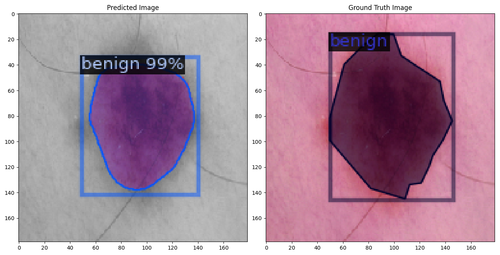
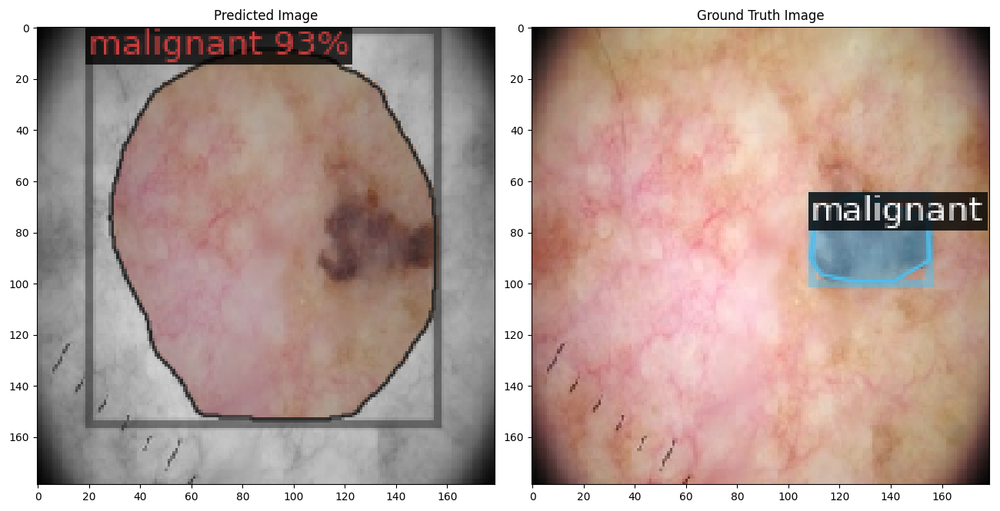
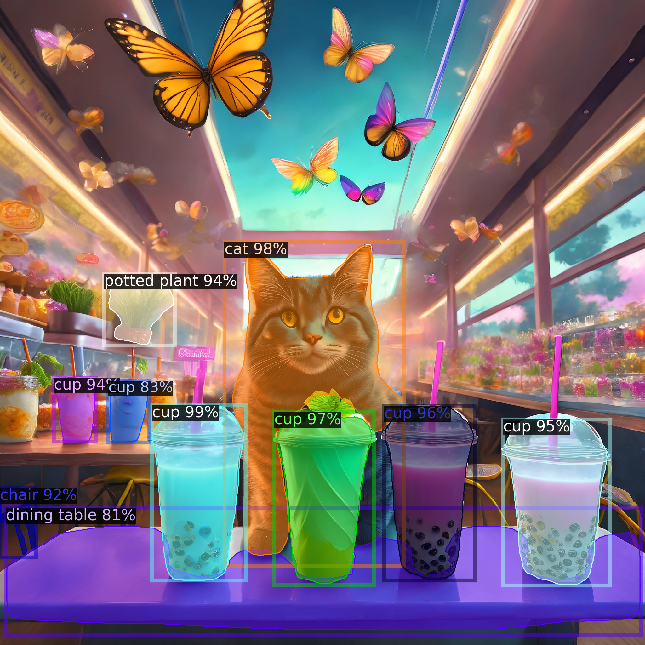

<!-- Logos -->

<a href="https://pytorch.org/" target="_blank" rel="noopener noreferrer"></a>

<!-- Badges -->

[](https://www.python.org/downloads/source/)
[](https://pytorch.org/)

> Originally implemented in 2022. Codebase refactoring and package updates in 2026.

<!-- Title -->
<div align='center'>
  <h1> Object Detection and Image Segmentation Pipeline </h1>
</div>

# About

- Fine-tuning [Detectron2](https://github.com/facebookresearch/detectron2) models (Faster R-CNN, Mask R-CNN) on a [custom](https://detectron2.readthedocs.io/tutorials/datasets.html) dataset for object detection and image segmentation.
- Provides an image segmentation dataset manually built using Labelme+ for bounding box and mask annotations.
- MLOps pipeline: data pre-processing and registration, model fine-tuning, and real-time inference.

# Results

<p align="center">
  <a href="assets/inference_tissue1.png"></a>
  <a href="assets/inference_tissue2.png"></a>
</p>

<p align="center">
  <a href="assets/inference_cat.png"></a>
  <a href="assets/gif.gif"></a> 
</p>

https://github.com/user-attachments/assets/de48d6b1-0867-446d-a336-666a40493a8e

---

<!-- #region Project Architecture & Technology Stack -->
<details>
  <summary><h1 id="tech">Project Architecture & Technology Stack</h1></summary>

See [README-TEC.md](developers_guide/README-TEC.md).

</details>
<!-- #endregion -->

---

<!-- #region Conda Environment -->
<details>
  <summary><h1 id="">Conda Environment</h1></summary>

Create the conda environment:

```bash
conda env create -f environment.yml --verbose && conda activate detectron2
```

Install detectron2 (make sure to have `gcc & g++ ≥ 5.4`).

```bash
python -m pip install 'git+https://github.com/facebookresearch/detectron2.git'
```

## labelme+

Pip install `labelme+` to manually label images for your custom dataset.
To avoid conflicts, create a new conda environment:

```bash
conda create -yn labelme python==3.9.13 && conda activate labelme
```

```bash
pip install enhancedlabelme==1.8.2
```

Run from terminal:

```bash
labelme+
```

> Note: do not rename the image files after labeling, otherwise the '.json' file metadata will lose its link with the image.

</details>
<!-- #endregion -->

---

<!-- #region Training Usage -->
<details>
  <summary><h1 id="">Training Usage</h1></summary>

```ShellSession
python -m src.train <model_type> <device> <config_file>

Required Arguments:
  model_type                       Model type: 'object_detection', 'instance_segmentation', 'panoptic_segmentation', or 'keypoint'.

Optional Arguments:
  device                           Training with either 'cpu' or 'cuda'. Defaults to 'cpu'.
  config_file                      Path of the configuration file containing hyperparameters. Defaults to 'configs/config.cfg'.
```

Usage:

```bash
python -m src.train 'instance_segmentation'
```

The default `configs/config.cfg` is tuned for the 224x224 tissue dataset. For CPU training, it uses `n_workers = 0`, `cpu_threads = 1`, and `log_period = 1`, reporting progress at every iteration.

</details>
<!-- #endregion -->

---

<!-- #region Inference Usage -->
<details>
  <summary><h1 id="">Inference Usage</h1></summary>

```ShellSession
inference.py --model [--threshold] [--image] [--video] [--cam] [--skip_frames] [--frame_batch]
[--res_factor] [--verbose] [--save_gif] [--save_video] [--max_video_size_mb]

Required Arguments:
  -m, --model (str)                       Model type: 'object_detection', 'instance_segmentation', 'panoptic_segmentation', or 'keypoint'.

Optional Arguments:
  -w, --weights (str)                     Path to the model's weights.
  -t, --threshold (float)                 Detection threshold value.
  -d, --device (str)                      Device option ('cpu' or 'gpu'). Defaults to 'cpu'.
  -i, --image (str)                       Filename to run inference on image.
  -v, --video (str)                       Filename to run inference on video.
  -c, --cam (bool)                        Whether to run inference on webcam.
  -sg, --save_gif (str)                   Path to save a gif of video inference.
  -sv, --save_video (str)                 Path to save a video of video inference.
  --max_video_size_mb (float)             Maximum size in MB for saved videos. Defaults to 10. Use 0 to disable recompression.
  -vb, --verbose (bool)                   Whether to display the gif inference on-the-fly.
  -sf, --skip_frames (int)                Number of frames to skip between detections.
  -fb, --frame_batch (int)                Number of total frames to be detected.
  -rf, --res_factor (float)               Percentage by which the output height is reduced while preserving aspect ratio. Defaults to 0.
```

Run inference on image with the fine-tuned model:

```bash
python -m src.inference -m 'instance_segmentation' -w '../artifacts/model_final.pth' -t 0.3 --image 'dataset/test/benign_2.jpg'
```

Run inference on image with the built-in model:

```bash
python -m src.inference -m 'panoptic_segmentation' -t 0.8 --image 'assets/cat.png'
```

Run inference on video and save GIF:

```bash
python -m src.inference -m 'instance_segmentation' -t 0.8 --video 'assets/taipei.mp4' --save_gif 'assets/gif.gif' --skip_frames 10 --frame_batch 500
```

Run inference on video and save video:

```bash
python -m src.inference -m 'instance_segmentation' -t 0.5 --video 'assets/taipei.mp4' --save_video 'assets/taipei_inference.mp4' --max_video_size_mb 10
```

Run inference on webcam:

```bash
python -m src.inference -m 'panoptic_segmentation' --cam True
```

</details>
<!-- #endregion -->
